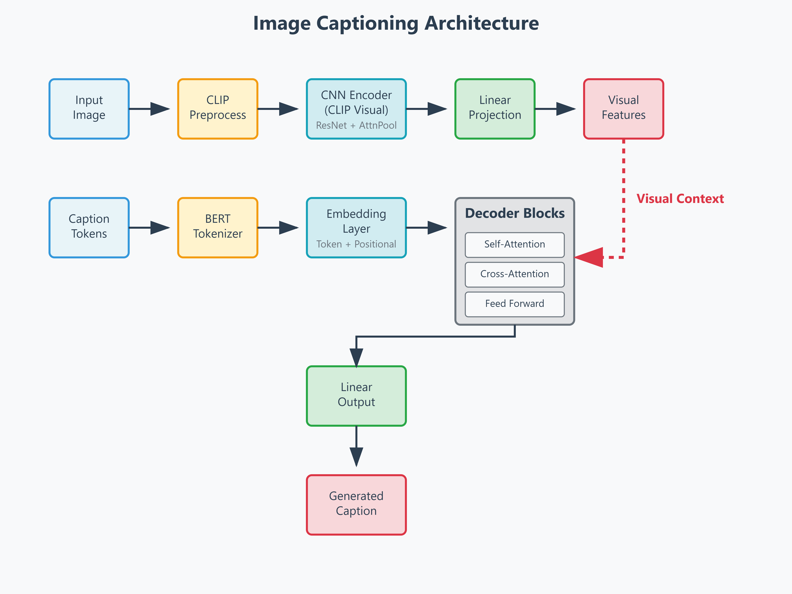
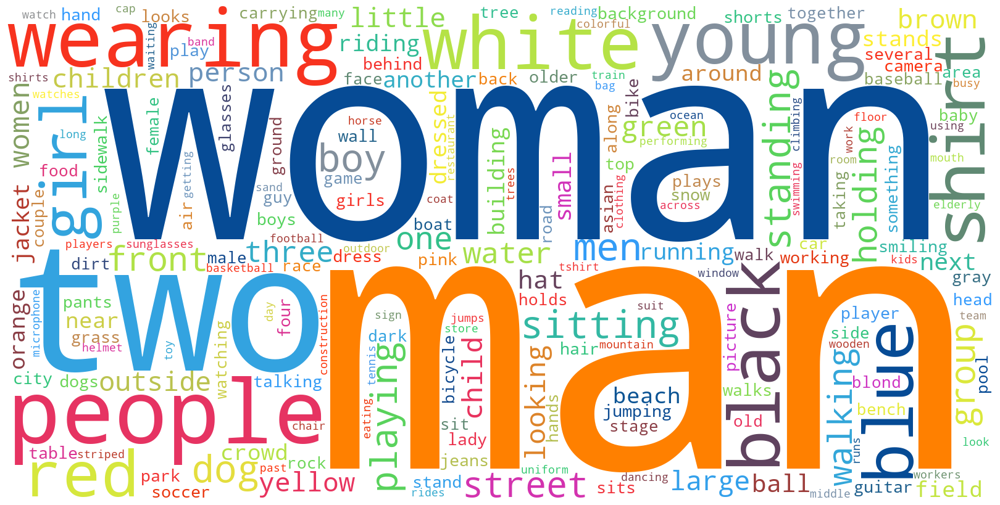
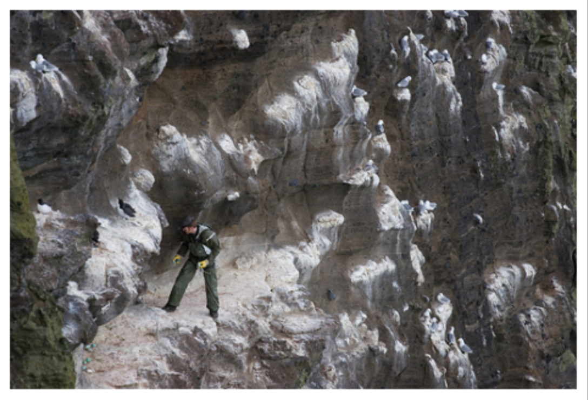
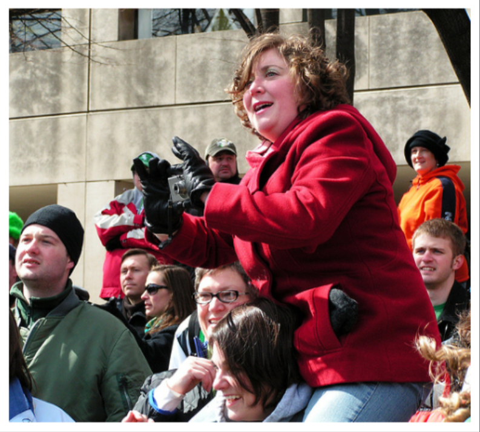
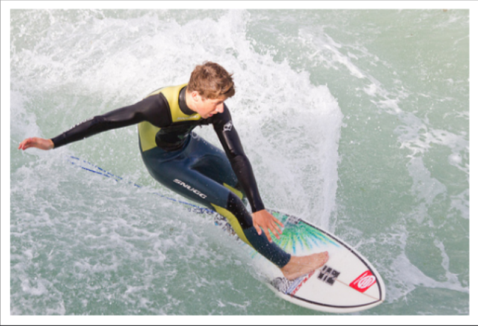

  
  
  
  
  

# Image Captioning with CLIP and a Transformer Decoder

This repository contains my final project for the Deep Learning course at ITS Academy Angelo Rizzoli. 

The goal of the project was to build a model capable of generating captions for images. We imagined it as a tool that could be implemented in assistive technologies for blind or visually impaired individuals. Although we did not implement text-to-speech functionality, the model can generate textual descriptions of visual content, which could be integrated into applications that convert these descriptions into audio, allowing users to receive verbal information about their surroundings or other visual inputs.

The architecture combines the visual encoder from **OpenAI's CLIP** with a custom-built **Transformer Decoder** using PyTorch Lightning. 
This was my first hands-on experience implementing a Transformer, which gave me a much deeper understanding of how attention mechanisms work in practice, especially the interplay between self-attention and cross-attention.

### Project Resources
You can find the model.ckpt paired with the final notebook on my kaggle profile **[here](https://www.kaggle.com/datasets/marcoferrarini/transformer-image-captioning)**

## Architecture 

The model is built on an Encoder-Decoder structure. Instead of a standard CNN, we used CLIP's pre-trained ResNet-50 as the encoder. 
We first tried a [ResNet50 for image classification from NVIDIA](https://catalog.ngc.nvidia.com/orgs/nvidia/resources/resnet_50_v1_5_for_pytorch) but the results were not sufficients due to the nature of the network. 

The **classic goal of ResNets is classifying** the image's main subject into 1000 categories, while **Our goal was explaining** a much richer situation and context: **Who's there? Where are they? What are they doing?** 

Given an image and a set of descriptions CLIP's goal is to select the most accurate description. Our guess is that the net already had the ability to extract complex visual features from pictures. 

The implementation turned out to be quite effective,  because CLIP's visual model is already trained to link complex images to syntactic concepts. 

Here's the data flow:

The implementation is broken down into these modules:

1.  **`CNN_encoder`**: This module takes an image and passes it through CLIP's frozen `RN50` backbone to get a feature vector. A `Linear` layer and `BatchNorm1d` then project these features to the right dimension for the decoder.

2.  **`Embedding_layer`**: This handles the text input. It converts a sequence of tokens into embeddings by summing their *token embeddings* and *positional embeddings*.

3.  **`Decoder_block`**: Each block contains three sub-layers:
    *   **Masked Self-Attention**: To process the text sequence generated so far.
    *   **Cross-Attention**: This is where the model connects vision and language. It allows the decoder to focus on relevant parts of the image (from the `CNN_encoder`) when predicting the next word.
    *   **Feed-Forward Network**: A final processing step after the attention layers.

4.  **`Image_Captioning` (`LightningModule`)**: This top-level class ties everything together. It assembles the encoder and a stack of `Decoder_block`s and manages the training loop using teacher forcing.

## Training Strategy: Two-Phase Fine-Tuning

Training a model with pre-trained components requires a careful approach. To avoid overwriting the valuable knowledge in CLIP, a two-phase fine-tuning strategy was used, automated with a custom PyTorch Lightning callback.

-   **Phase 1: Freeze and Train**. For the first epochs, CLIP's backbone is completely frozen. Only the new layers—the decoder, the projection head, and batch norm—are trained. This lets the decoder learn its task without disrupting the encoder. The learning rate here is `1e-6`.

-   **Phase 2: Unfreeze and Fine-Tune**. After n epochs, the callback unfreezes the final layers of the CLIP backbone (`layer4` and `attnpool`). These layers are added to the optimizer with a very low learning rate (`1e-8`). This allows the visual model to make small adjustments specific to the captioning task, improving performance without forgetting its original training. A bigger learning rate lead to gradient explosion, so we had to be quite delicate with that.

## Dataset & Tokenization

-   **Dataset**: We used **Flickr30k**, which contains over 30,000 images, each with 5 captions. It's a solid dataset for this task and manageable enough.
-   **Tokenizer**:`bert-base-uncased` tokenizer from Hugging Face's `transformers` library was used. A wrapper class handles the details of adding `<SOS>`/`<EOS>` tokens, padding, and truncation.

Although the dataset is well-structured and of a decent size, the quality of the descriptions is poor and highly influenced by biases. This results in lower overall quality in the generated descriptions.

The following word cloud offers a quick visual overview of the most frequently used words:

## Results & Demonstration

The model generates plausible captions for images it has never seen before. The quality of the output shows that it learned to map visual concepts to words effectively.

Below are a few examples from the test set, comparing the generated caption against the original ground truth captions from the Flickr30k dataset.

---

### Example 1 - 2255332561.jpg

  

- **Generated Caption:** `a mountain climber scaling a steep mountain.`

- **Ground Truth Captions:**
  - `A man is on the side of a mountain and hiking around huge rocks .`
  - `a lone man climbing the side of a large rock wall .`
  - `A man stands on the rocky ledge of a large cliff .`
  - `A person stands atop a rock face .`
  - `The man is on the mountainside .`

---

### Example 2 - 425990453.jpg

  

- **Generated Caption:** `a woman in a red jacket and hat is holding a camera.`

- **Ground Truth Captions:**
  - `A group of people stare in the same direction and one woman sits on another woman 's shoulders to take a picture .`
  - `A woman in a red jacket taking photos is sitting on the shoulders of another woman among a crowd of people .`
  - `A woman is taking a picture on the shoulders of another woman in cold weather .`
  - `A woman in a red coat is on another woman 's shoulders in a crowd .`
  - `woman holding another to take a picture .`

---

### Example 3 - 7368081478.jpg

  

- **Generated Caption:** `a young man in a black wetsuit surfs on a surfboard.`

- **Ground Truth Captions:**
  - `A brown-haired man in a black  yellow  and blue wetsuit is surfing .`
  - `Man in a wetsuit is surfing a wave on a white and green surfboard .`
  - `A man surfing on a white surfboard wearing specialized clothing .`
  - `A man in a yellow and black wetsuit is surfing a small wave .`
  - `A man in a black and yellow wetsuit is surfing .`

---

## Key Learnings 

This project helped me gain practical experience in:
-   Implementing Transformer components like self-attention, cross-attention, and positional encodings.
-   Using a two-phase fine-tuning strategy with custom PyTorch Lightning callbacks.
-   Building a multimodal architecture that combines separate, pre-trained models.
-   Structuring a deep learning project with clean, reusable modules.
-   Managing an end-to-end workflow, from creating a custom `Dataset` to writing an inference function.

## Conclusion

This project successfully builds a functional image captioning model by combining CLIP and a Transformer decoder. It’s a practical implementation of modern multimodal techniques and was a great learning experience.

**Author**: Marco Ferrarini

**Acknowledgements**: This project was a collaborative effort. A special thanks to my teammates **Bono Davide**, **Simone Lorenzo Pe**, and **Riccardo Sacchetti** for their work and insights.
